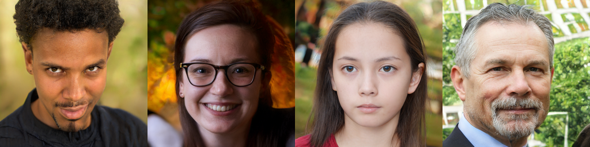
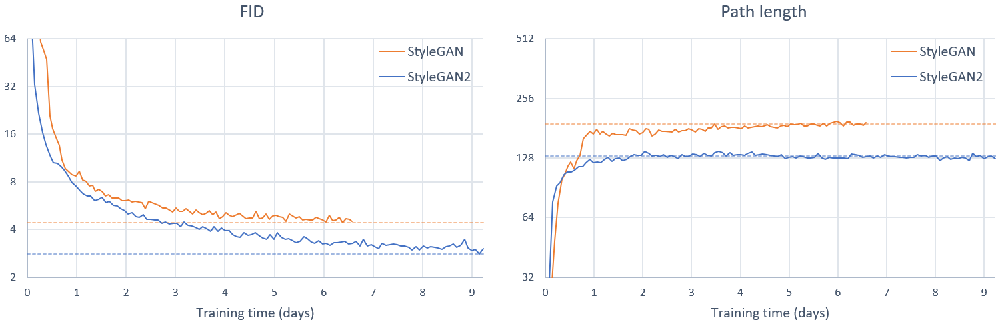

# Let's have fun with StyleGAN2!

SOTA GANs can become cumbersome or even downright intimidating, if not daunting. StyleGAN2 is no different, especially when you consider the compute capabilities usually needed to fully train one model from scratch. This is what this repo is here for!

We add some features to StyleGAN2's official repo, so please get acquainted with the latter before delving deep into this one. Take special attention to the  [Requirements](#requirements), in order for the code to run correctly. Should you encounter any errors, check out a possible solution in [Troubleshooting](#tshoot)

In essence,this repo adds two new features:
* [Interpolation videos](#latent)
    * Random vector interpolation
    * Style mixing
* [Projection videos](#proj)
    * Generate the projection video of a real or generated image

Two other changes have been made to the original repo, specifically also in `run_generator.py`:

* When generating random images by seed number, you can now save them in a grid by adding `--grid=True`; the grid dimensions will be inferred by the number of `--seeds` you use
* The `_parse_num_range(s)` function has been modified in order to accept any combination of comma separated values, ranges, or combination of both, i.e.: `--seeds=1,2,5-100,999` is now also accepted
    * *Caution:* for `style-mixing-video`, for example, using too many `--col-seeds` will result in an OOM
<a name="tshoot"></a>
## Troubleshooting

But first, some troubleshooting: if, by some reason, you run into the following error while attempting to run the official repo in Ubuntu 18.04:

```
error: #error "C++ versions less than C++11 are not supported."
```

know that you are not alone and that many have suffered as you surely have. The good news is that there's a [quick fix](https://stackoverflow.com/a/59368180) for this: modify the `nvcc` call in [line 64](https://github.com/NVlabs/stylegan2/blob/7d3145d23013607b987db30736f89fb1d3e10fad/dnnlib/tflib/custom_ops.py#L64) in `dnnlib/tflib/custom_ops.py` by replacing it with:

```python
cmd = 'nvcc --std=c++11 -DNDEBUG ' + opts.strip()
```

The bad news is that it doesn't always work, and it's not a *pretty* fix, but at least it let me run the code on my PC. You might not encounter this error, but make sure to always check if you meet the [Requirements](#requirements), especially by running the test `test_nvcc.cu`.

<a name="latent"></a>
## Latent space exploration

What is a trained GAN without a bit of latent space exploration? We can do the typical interpolation between random latent vectors, as well as some [style mixing](https://youtu.be/c-NJtV9Jvp0?t=145) as in the oficial repo, which we can of course recreate.

### Random interpolation

A linear interpolation or [lerp](https://en.wikipedia.org/wiki/Linear_interpolation) is done between random vectors in $\mathcal{Z}$, which in turn will be mapped into $\mathcal{W}$ by the Generator. There are two options:

* Give a list of `--seeds` (in the form `a,b,c`, `a-b,c`, or even a combination `a,b-c,d`), and the code will infer the best width and height for the generated video. For example, we wish the seeds to be from `42` to `47` (inclusive), then we run:

```
python run_generator.py lerp-video --network=gdrive:networks/stylegan2-ffhq-config-f.pkl \
    --seeds=42-47
```


 By default, we will have that `--truncation-psi=1.0`, `--duration-sec=30.0` and `--fps=30`, so modify these as you please.

* Give a single seed in `seeds`, as well as the grid width and height (`--grid-w` and `--grid-h`, respectively) for the generated video. We can then generate a 60fps, 15 second video of size 2x2, with $\psi=0.7$ like so:

```
python run_generator.py lerp-video --network=gdrive:networks/stylegan2-ffhq-config-f.pkl \
    --seeds=1000 --grid-w=2 --grid-h=2 --truncation-psi=0.7 --fps=60 --duration-sec=15
```


### Style mixing

Harkening to StyleGAN's [style mixing figure](https://github.com/NVlabs/stylegan/blob/66813a32aac5045fcde72751522a0c0ba963f6f2/generate_figures.py#L59), we can also mix different styles from the source images `--col-seeds` onto the destination image `--row-seed`:

```
python run_generator.py style-mixing-video --network=gdrive:networks/stylegan2-ffhq-config-f.pkl \
    --col-seeds=55,821,1789,293 --row-seed=85
```


 By default, we will have that `--truncation-psi=0.7`, `--duration-sec=30.0`, `--fps=30`, and `--col-styles=0-6`, which indicates that we will use the styles from layers $4^2$ up to the first layer of the $32^2$ (remember there are two per layer). So, if you wish to only use the *fine* styles, i.e., from $64^2$ up to $1024^2$, run:

```
python run_generator.py style-mixing-video --network=gdrive:networks/stylegan2-ffhq-config-f.pkl \
    --col-seeds=55,821,1789,293 --row-seed=85 --col-styles=8-17
```


In essence, you will take the `styles` from the `--row-seed` and apply them to the `styles` from the `--col-seeds`. So, if you wish to apply the **coarse styles** defined in the StyleGAN paper, you must use `--col-styles=0-3`; for the **middle styles**, use `--col-styles=4-7`; and finally, for the **fine styles**, use `--col-styles=8-max`, where `max` will depend on the generated image size of your model. The following table gives a small summary of this `max` value:

| `Gs.ouptut_shape[-1]` | max(`--col-styles`) |
| --- | --- |
| `128` | `11` |
| `256` | `13` |
| `512` | `15` |
| `1024` | `17` |

I hope you get the gist.

<a name="proj"></a>
## Recreating the Projection Videos

To generate your own projection videos [as in the official implementation](https://drive.google.com/open?id=1ZpEiQuUFm4XQRUxoJj3f4O8-f102iXJc), you must of course have to have a projection in your `results` subdir!

For example, to project generated images by your trained model, run:

```
python run_projector.py project-generated-images \
    --network=/path/to/network/pkl --num-snapshots=1000 \
    --seeds=....
```

where, if you know specific seeds that you wish to project, include it in the argument.

To project real images, these must be in a `tfrecord` file, so the easiest thing to do is to use the file you used to train your [StyleGAN](https://github.com/NVlabs/stylegan) or StyleGAN2 model (as a side note, I must put emphasis on the fact that **you can use either a trained model.pkl from StyleGAN or StyleGAN2**, so this projection code can be used for your *old* StyleGAN models).

Then, to project real images, run:

```
python run_projector.py project-real-images \
    --network=/path/to/network/pkl \
    --data-dir=/path/to/tfrecord/root/dir \
    --dataset=tfrecord_name --num-snapshots=1000 \
    --num-images=N(as many as you wish/have the time)
```

Take heed that, if you run the above code, say, two times, with the first time setting `--num-images 5` and the second time setting `--num-images 10`, then the first run will be contained in the second, as they will have the same seed. As such, if you wish to project a specific set of real images from your training data, then simply convert these to a `tfrecord` file with `dataset_tool.py` and you don't have to worry about when you will get the specific image(s) you want to project.

Note that `--num-snapshots 1000` is required for the bash script below, as the final video will be of length of 20 seconds, and will run at 50 fps. Modifying this and in turn the length of the projection video is not so complicated, so feel free to so, but remember to modify **both** numbers.

So now you just have to run:

```
./projection_video.sh 1
```

if, for example, your Run 1 was a projection of real or generated images, i.e., the directory in `results` is `00001-project-generated-images` or `00001-project-real-images`.

The result of this bash script will be that your images will be sorted in subdirectories in each run by either seed or real image number, like so:

```
./results/00001-project-real-images
├   _finished.txt
├───image0000
│   ├   image0000-projection.mp4
│   ├   image0000-step0001.png
│   ├   ...
│   └   image0000-step0999.png
├───image0001
│   ├   image0001-projection.mp4
│   ├   image0001-step0001.png
│   ├   ...
│   └   image0001-step0999.png
├───image0002
├───...
├───run.txt
├───submit_config.pkl
└───submit_config.txt
```

For each of these, a projection video will be generated which will have, to the right, the *Target image* (be it generated or real), and to the left, the progression of the projection at each step, up to iteration 1000 (hence why 1000 snapshots).

An example of this is the following, where we are projecting a center-cropped image of the [A2D2](https://www.audi-electronics-venture.de/aev/web/de/driving-dataset.html) dataset into the latent space of the StyleGAN2 trained only on the [FFHQ](https://github.com/NVlabs/ffhq-dataset) dataset:

[](https://youtu.be/9-CUDF07cEE)

## Mass Projector

Another tool that was useful for my purposes is `mass_projector.sh`, where, given a directory with all the model checkpoints you wish to analyze, you can then project as many images as you wish on each checkpoint in order to do a better analysis, such as calculating the PSNR, SSIM or MSE between the projected and target image.

**I truly have no idea if this will be useful for someone else, but it was for me, so I add it here.**

Usage:

```
./mass_projector.sh name-of-dataset /dataset/root/path /models/root/path N
```

where `name-of-dataset` will be the name of your dataset in your `/dataset/root/path` (the same terminology we use whilst projecting images or training the model), `/models/root/path` will be the path to the directory with all the models you wish to project, and `N` is the number of images you wish to project per `pkl` file (per model checkpoint).

Note that, by default, we will have `--num-snapshots=1`, as we are only interested in the final projection and also this will speed up the projection by $~3\times$ (i.e., from around 12 minutes to 4 minutes per image projected on an [NVIDIA 1080 GTX](https://www.geforce.com/hardware/desktop-gpus/geforce-gtx-1080/specifications)).

---

Henceforth, it will be the official implementation of StyleGAN2, so pay attention to the official author's notes:

---

## StyleGAN2 &mdash; Official TensorFlow Implementation



**Analyzing and Improving the Image Quality of StyleGAN**<br>
Tero Karras, Samuli Laine, Miika Aittala, Janne Hellsten, Jaakko Lehtinen, Timo Aila<br>

Paper: http://arxiv.org/abs/1912.04958<br>
Video: https://youtu.be/c-NJtV9Jvp0<br>

Abstract: *The style-based GAN architecture (StyleGAN) yields state-of-the-art results in data-driven unconditional generative image modeling. We expose and analyze several of its characteristic artifacts, and propose changes in both model architecture and training methods to address them. In particular, we redesign generator normalization, revisit progressive growing, and regularize the generator to encourage good conditioning in the mapping from latent vectors to images. In addition to improving image quality, this path length regularizer yields the additional benefit that the generator becomes significantly easier to invert. This makes it possible to reliably detect if an image is generated by a particular network. We furthermore visualize how well the generator utilizes its output resolution, and identify a capacity problem, motivating us to train larger models for additional quality improvements. Overall, our improved model redefines the state of the art in unconditional image modeling, both in terms of existing distribution quality metrics as well as perceived image quality.*

For business inquiries, please contact [researchinquiries@nvidia.com](mailto:researchinquiries@nvidia.com)<br>
For press and other inquiries, please contact Hector Marinez at [hmarinez@nvidia.com](mailto:hmarinez@nvidia.com)<br>

| Additional material | &nbsp;
| :--- | :----------
| [StyleGAN2](https://drive.google.com/open?id=1QHc-yF5C3DChRwSdZKcx1w6K8JvSxQi7) | Main Google Drive folder
| &boxvr;&nbsp; [stylegan2-paper.pdf](https://drive.google.com/open?id=1fnF-QsiQeKaxF-HbvFiGtzHF_Bf3CzJu) | High-quality version of the paper
| &boxvr;&nbsp; [stylegan2-video.mp4](https://drive.google.com/open?id=1f_gbKW6FUUHKkUxciJ_lQx29mCq_fSBy) | High-quality version of the video
| &boxvr;&nbsp; [images](https://drive.google.com/open?id=1Sak157_DLX84ytqHHqZaH_59HoEWzfB7) | Example images produced using our method
| &boxv;&nbsp; &boxvr;&nbsp;  [curated-images](https://drive.google.com/open?id=1ydWb8xCHzDKMTW9kQ7sL-B1R0zATHVHp) | Hand-picked images showcasing our results
| &boxv;&nbsp; &boxur;&nbsp;  [100k-generated-images](https://drive.google.com/open?id=1BA2OZ1GshdfFZGYZPob5QWOGBuJCdu5q) | Random images with and without truncation
| &boxvr;&nbsp; [videos](https://drive.google.com/open?id=1yXDV96SFXoUiZKU7AyE6DyKgDpIk4wUZ) | Individual clips of the video as high-quality MP4
| &boxur;&nbsp; [networks](https://drive.google.com/open?id=1yanUI9m4b4PWzR0eurKNq6JR1Bbfbh6L) | Pre-trained networks
| &ensp;&ensp; &boxvr;&nbsp;  [stylegan2-ffhq-config-f.pkl](https://drive.google.com/open?id=1Mgh-jglZjgksupF0XLl0KzuOqd1LXcoE) | StyleGAN2 for <span style="font-variant:small-caps">FFHQ</span> dataset at 1024&times;1024
| &ensp;&ensp; &boxvr;&nbsp;  [stylegan2-car-config-f.pkl](https://drive.google.com/open?id=1MutzVf8XjNo6TUg03a6CUU_2Vlc0ltbV) | StyleGAN2 for <span style="font-variant:small-caps">LSUN Car</span> dataset at 512&times;384
| &ensp;&ensp; &boxvr;&nbsp;  [stylegan2-cat-config-f.pkl](https://drive.google.com/open?id=1MyowTZGvMDJCWuT7Yg2e_GnTLIzcSPCy) | StyleGAN2 for <span style="font-variant:small-caps">LSUN Cat</span> dataset at 256&times;256
| &ensp;&ensp; &boxvr;&nbsp;  [stylegan2-church-config-f.pkl](https://drive.google.com/open?id=1N3iaujGpwa6vmKCqRSHcD6GZ2HVV8h1f) | StyleGAN2 for <span style="font-variant:small-caps">LSUN Church</span> dataset at 256&times;256
| &ensp;&ensp; &boxvr;&nbsp;  [stylegan2-horse-config-f.pkl](https://drive.google.com/open?id=1N55ZtBhEyEbDn6uKBjCNAew1phD5ZAh-) | StyleGAN2 for <span style="font-variant:small-caps">LSUN Horse</span> dataset at 256&times;256
| &ensp;&ensp; &boxur;&nbsp;&#x22ef;  | Other training configurations used in the paper

<a name="requirements"></a>
## Requirements

* Both Linux and Windows are supported. Linux is recommended for performance and compatibility reasons.
* 64-bit Python 3.6 installation. We recommend Anaconda3 with numpy 1.14.3 or newer.
* TensorFlow 1.14 or 1.15 with GPU support. The code does not support TensorFlow 2.0.
* On Windows, you need to use TensorFlow 1.14 &mdash; TensorFlow 1.15 will not work.
* One or more high-end NVIDIA GPUs, NVIDIA drivers, CUDA 10.0 toolkit and cuDNN 7.5. To reproduce the results reported in the paper, you need an NVIDIA GPU with at least 16 GB of DRAM.
* Docker users: use the [provided Dockerfile](./Dockerfile) to build an image with the required library dependencies.

StyleGAN2 relies on custom TensorFlow ops that are compiled on the fly using [NVCC](https://docs.nvidia.com/cuda/cuda-compiler-driver-nvcc/index.html). To test that your NVCC installation is working correctly, run:

```.bash
nvcc test_nvcc.cu -o test_nvcc -run
| CPU says hello.
| GPU says hello.
```

On Windows, the compilation requires Microsoft Visual Studio to be in `PATH`. We recommend installing [Visual Studio Community Edition](https://visualstudio.microsoft.com/vs/) and adding into `PATH` using `"C:\Program Files (x86)\Microsoft Visual Studio\2019\Community\VC\Auxiliary\Build\vcvars64.bat"`.

## Preparing datasets

Datasets are stored as multi-resolution TFRecords, similar to the [original StyleGAN](https://github.com/NVlabs/stylegan). Each dataset consists of multiple `*.tfrecords` files stored under a common directory, e.g., `~/datasets/ffhq/ffhq-r*.tfrecords`. In the following sections, the datasets are referenced using a combination of `--dataset` and `--data-dir` arguments, e.g., `--dataset=ffhq --data-dir=~/datasets`.

**FFHQ**. To download the [Flickr-Faces-HQ](https://github.com/NVlabs/ffhq-dataset) dataset as multi-resolution TFRecords, run:

```.bash
pushd ~
git clone https://github.com/NVlabs/ffhq-dataset.git
cd ffhq-dataset
python download_ffhq.py --tfrecords
popd
python dataset_tool.py display ~/ffhq-dataset/tfrecords/ffhq
```

**LSUN**. Download the desired LSUN categories in LMDB format from the [LSUN project page](https://www.yf.io/p/lsun). To convert the data to multi-resolution TFRecords, run:

```.bash
python dataset_tool.py create_lsun_wide ~/datasets/car ~/lsun/car_lmdb --width=512 --height=384
python dataset_tool.py create_lsun ~/datasets/cat ~/lsun/cat_lmdb --resolution=256
python dataset_tool.py create_lsun ~/datasets/church ~/lsun/church_outdoor_train_lmdb --resolution=256
python dataset_tool.py create_lsun ~/datasets/horse ~/lsun/horse_lmdb --resolution=256
```

**Custom**. Create custom datasets by placing all training images under a single directory. The images must be square-shaped and they must all have the same power-of-two dimensions. To convert the images to multi-resolution TFRecords, run:

```.bash
python dataset_tool.py create_from_images ~/datasets/my-custom-dataset ~/my-custom-images
python dataset_tool.py display ~/datasets/my-custom-dataset
```

## Using pre-trained networks

Pre-trained networks are stored as `*.pkl` files on the [StyleGAN2 Google Drive folder](https://drive.google.com/open?id=1QHc-yF5C3DChRwSdZKcx1w6K8JvSxQi7). Below, you can either reference them directly using the syntax `gdrive:networks/<filename>.pkl`, or download them manually and reference by filename.

**Generating images**:

```.bash
# Generate uncurated ffhq images (matches paper Figure 12)
python run_generator.py generate-images --network=gdrive:networks/stylegan2-ffhq-config-f.pkl \
  --seeds=6600-6625 --truncation-psi=0.5

# Generate curated ffhq images (matches paper Figure 11)
python run_generator.py generate-images --network=gdrive:networks/stylegan2-ffhq-config-f.pkl \
  --seeds=66,230,389,1518 --truncation-psi=1.0

# Generate uncurated car images
python run_generator.py generate-images --network=gdrive:networks/stylegan2-car-config-f.pkl \
  --seeds=6000-6025 --truncation-psi=0.5

# Example of style mixing (matches the corresponding video clip)
python run_generator.py style-mixing-example --network=gdrive:networks/stylegan2-ffhq-config-f.pkl \
  --row-seeds=85,100,75,458,1500 --col-seeds=55,821,1789,293 --truncation-psi=1.0
```

The results are placed in `results/<RUNNING_ID>/*.png`. You can change the location with `--result-dir`. For example, `--result-dir=~/my-stylegan2-results`.

**Projecting images to latent space**:

```.bash
# Project generated images
python run_projector.py project-generated-images --network=gdrive:networks/stylegan2-car-config-f.pkl \
  --seeds=0,1,5

# Project real images
python run_projector.py project-real-images --network=gdrive:networks/stylegan2-car-config-f.pkl \
  --dataset=car --data-dir=~/datasets
```

You can import the networks in your own Python code using `pickle.load()`. For this to work, you need to include the `dnnlib` source directory in `PYTHONPATH` and create a default TensorFlow session by calling `dnnlib.tflib.init_tf()`. See [run_generator.py](./run_generator.py) and [pretrained_networks.py](./pretrained_networks.py) for examples.

## Training networks

To reproduce the training runs for config F in Tables 1 and 3, run:

```.bash
python run_training.py --num-gpus=8 --data-dir=~/datasets --config=config-f \
  --dataset=ffhq --mirror-augment=true
python run_training.py --num-gpus=8 --data-dir=~/datasets --config=config-f \
  --dataset=car --total-kimg=57000
python run_training.py --num-gpus=8 --data-dir=~/datasets --config=config-f \
  --dataset=cat --total-kimg=88000
python run_training.py --num-gpus=8 --data-dir=~/datasets --config=config-f \
  --dataset=church --total-kimg 88000 --gamma=100
python run_training.py --num-gpus=8 --data-dir=~/datasets --config=config-f \
  --dataset=horse --total-kimg 100000 --gamma=100
```

For other configurations, see `python run_training.py --help`.

We have verified that the results match the paper when training with 1, 2, 4, or 8 GPUs. Note that training FFHQ at 1024&times;1024 resolution requires GPU(s) with at least 16 GB of memory. The following table lists typical training times using NVIDIA DGX-1 with 8 Tesla V100 GPUs:

| Configuration | Resolution      | Total kimg | 1 GPU   | 2 GPUs  | 4 GPUs  | 8 GPUs | GPU mem |
| :------------ | :-------------: | :--------: | :-----: | :-----: | :-----: | :----: | :-----: |
| `config-f`    | 1024&times;1024 | 25000      | 69d 23h | 36d 4h  | 18d 14h | 9d 18h | 13.3 GB |
| `config-f`    | 1024&times;1024 | 10000      | 27d 23h | 14d 11h | 7d 10h  | 3d 22h | 13.3 GB |
| `config-e`    | 1024&times;1024 | 25000      | 35d 11h | 18d 15h | 9d 15h  | 5d 6h  | 8.6 GB  |
| `config-e`    | 1024&times;1024 | 10000      | 14d 4h  | 7d 11h  | 3d 20h  | 2d 3h  | 8.6 GB  |
| `config-f`    | 256&times;256   | 25000      | 32d 13h | 16d 23h | 8d 21h  | 4d 18h | 6.4 GB  |
| `config-f`    | 256&times;256   | 10000      | 13d 0h  | 6d 19h  | 3d 13h  | 1d 22h | 6.4 GB  |

Training curves for FFHQ config F (StyleGAN2) compared to original StyleGAN using 8 GPUs:



After training, the resulting networks can be used the same way as the official pre-trained networks:

```.bash
# Generate 1000 random images without truncation
python run_generator.py generate-images --seeds=0-999 --truncation-psi=1.0 \
  --network=results/00006-stylegan2-ffhq-8gpu-config-f/networks-final.pkl
```

## Evaluation metrics

To reproduce the numbers for config F in Tables 1 and 3, run:

```.bash
python run_metrics.py --data-dir=~/datasets --network=gdrive:networks/stylegan2-ffhq-config-f.pkl \
  --metrics=fid50k,ppl_wend --dataset=ffhq --mirror-augment=true
python run_metrics.py --data-dir=~/datasets --network=gdrive:networks/stylegan2-car-config-f.pkl \
  --metrics=fid50k,ppl2_wend --dataset=car
python run_metrics.py --data-dir=~/datasets --network=gdrive:networks/stylegan2-cat-config-f.pkl \
  --metrics=fid50k,ppl2_wend --dataset=cat
python run_metrics.py --data-dir=~/datasets --network=gdrive:networks/stylegan2-church-config-f.pkl \
  --metrics=fid50k,ppl2_wend --dataset=church
python run_metrics.py --data-dir=~/datasets --network=gdrive:networks/stylegan2-horse-config-f.pkl \
  --metrics=fid50k,ppl2_wend --dataset=horse
```

For other configurations, see the [StyleGAN2 Google Drive folder](https://drive.google.com/open?id=1QHc-yF5C3DChRwSdZKcx1w6K8JvSxQi7).

Note that the metrics are evaluated using a different random seed each time, so the results will vary between runs. In the paper, we reported the average result of running each metric 10 times. The following table lists the available metrics along with their expected runtimes and random variation:

| Metric      | FFHQ config F  | 1 GPU  | 2 GPUs  | 4 GPUs | Description |
| :---------- | :------------: | :----: | :-----: | :----: | :---------- |
| `fid50k`    | 2.84 &pm; 0.03 | 22 min | 14 min  | 10 min | [Fr&eacute;chet Inception Distance](https://arxiv.org/abs/1706.08500)
| `is50k`     | 5.13 &pm; 0.02 | 23 min | 14 min  | 8 min  | [Inception Score](https://arxiv.org/abs/1606.03498)
| `ppl_zfull` | 348.0 &pm; 3.8 | 41 min | 22 min  | 14 min | [Perceptual Path Length](https://arxiv.org/abs/1812.04948) in Z, full paths
| `ppl_wfull` | 126.9 &pm; 0.2 | 42 min | 22 min  | 13 min | [Perceptual Path Length](https://arxiv.org/abs/1812.04948) in W, full paths
| `ppl_zend`  | 348.6 &pm; 3.0 | 41 min | 22 min  | 14 min | [Perceptual Path Length](https://arxiv.org/abs/1812.04948) in Z, path endpoints
| `ppl_wend`  | 129.4 &pm; 0.8 | 40 min | 23 min  | 13 min | [Perceptual Path Length](https://arxiv.org/abs/1812.04948) in W, path endpoints
| `ppl2_wend` | 145.0 &pm; 0.5 | 41 min | 23 min  | 14 min | [Perceptual Path Length](https://arxiv.org/abs/1812.04948) without center crop
| `ls`        | 154.2 / 4.27   | 10 hrs | 6 hrs   | 4 hrs  | [Linear Separability](https://arxiv.org/abs/1812.04948)
| `pr50k3`    | 0.689 / 0.492  | 26 min | 17 min  | 12 min | [Precision and Recall](https://arxiv.org/abs/1904.06991)

Note that some of the metrics cache dataset-specific data on the disk, and they will take somewhat longer when run for the first time.

## License

Copyright &copy; 2019, NVIDIA Corporation. All rights reserved.

This work is made available under the Nvidia Source Code License-NC. To view a copy of this license, visit https://nvlabs.github.io/stylegan2/license.html

## Citation

```
@article{Karras2019stylegan2,
  title   = {Analyzing and Improving the Image Quality of {StyleGAN}},
  author  = {Tero Karras and Samuli Laine and Miika Aittala and Janne Hellsten and Jaakko Lehtinen and Timo Aila},
  journal = {CoRR},
  volume  = {abs/1912.04958},
  year    = {2019},
}
```

## Acknowledgements

We thank Ming-Yu Liu for an early review, Timo Viitanen for his help with code release, and Tero Kuosmanen for compute infrastructure.
